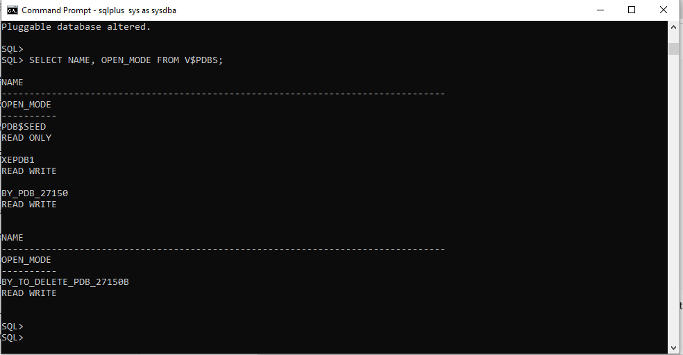

# Oracle 21c Pluggable Database (PDB) Management
**Author:** BYIRINGIRO Urban Bobola  
**Database Name:** `BY_PDB_27150`  
**Admin User:** `urban_plsqluca_27150 / Urban#2024`  
**Environment:** Oracle Database 21c Express Edition (XE)  
**SQL Tool:** SQL*Plus  
**Oracle Home Path:** `D:\iru\dbhomeXE`

---

##  Overview  
This project demonstrates how to create, configure, open, and delete pluggable databases (PDBs) using **Oracle Multitenant Architecture**.  
It includes:  
1. Creating a new PDB (`BY_PDB_27150`)  
2. Creating and deleting another PDB (`BY_TO_DELETE_PDB_27150`)  
3. Managing user privileges and verifying connections  

---
##  Screenshoot images


 





## ⚙️ Step 1: Connect as SYSDBA
Open **Command Prompt (cmd)** and run:

```sql
sqlplus / as sysdba

